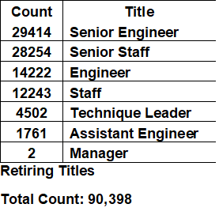
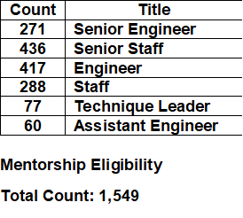

# pewlett-hackard-analysis
Week 7 - SQL

## Overview of the analysis
Pewlett-Hackard is a large company that has been in business for many years. The "baby boomers" of the company, those born between 1/1/1952-12/31/1955 according to our data, are getting ready to retire, and we have been tasked to assist the company with two deliverables:
  1. Determining the number of retring employees per title
  2. Identifying the employees who are eligible to participate in a mentorship program

The below are the results of our findings utilizing pgAdmin and exporting our findings into csv files found in the Data folder.

## Results
### Retiring Titles

### Mentorship Eligibility

- After analyzing the data, we came to find that 90,398 employees were born between 1952 and 1955. Currently, Pewlett-Hackard has a total of 331,603 employees. This means that of the total number of employees, those who will be retiring make up about 27.3% of the workforce.
- We can also see that of the employees, there are only 1,549 who are eligible for the mentorship program. 
- Another take away is that there are no mentors available under the "Managers" job title. Although this may not be seen as an issue, it is still something that the company will need to think about because they may need guidance for that job title down the line.
- Finally, the top 3 job titles whose employees will be retiring are "Senior Engineer," "Senior Staff" and "Engineer" respectively. These are highly skilled as well as highly experienced jobs.

## Summary
With the upcoming "Silver Tsunami" about to take place in Pewlett-Hackard, the data shows that 90,398 employees will be retiring, meaning that the company will need to fill close to 100,000 roles. Unfortunately, there is a disproportion between those retiring and those who are eligible for the mentorship program the company would like to roll out. For example, there are 29,414 senior engineer employees set to retire, while there are only 271 senior engineers who are currently eligible for the mentorship program. This would mean for every one senior engineer that is an eligible mentor, they would have to mentor at least 108 junior employees. That seems a bit unrealistic and almost impossible to do. The data also only specified those who were born between January 1 - December 31, 1965 that would have eligibility for the mentorship program. However, it would be beneficial if that this could be expanded from January 1, 1965 - December 31, 1970. This could make up for the deficit. Another query that could be done would be how many years one has been with the company to also determine mentorship eligibility as well as including their job title. There could be senior-leved employees that were missed in our original search that could also serve as mentors to junior and brand new employees who will be at Pewlett-Hackard.
